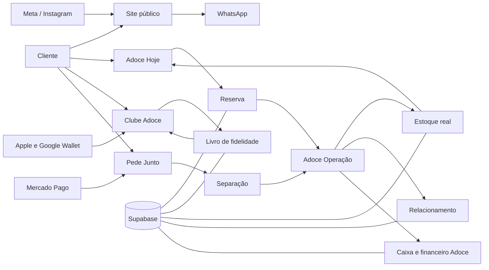
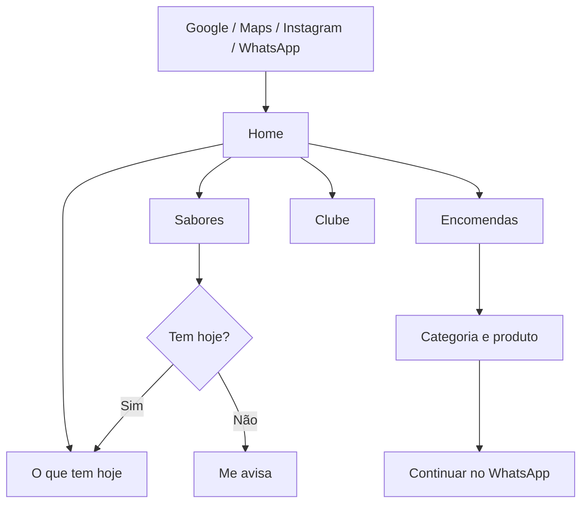
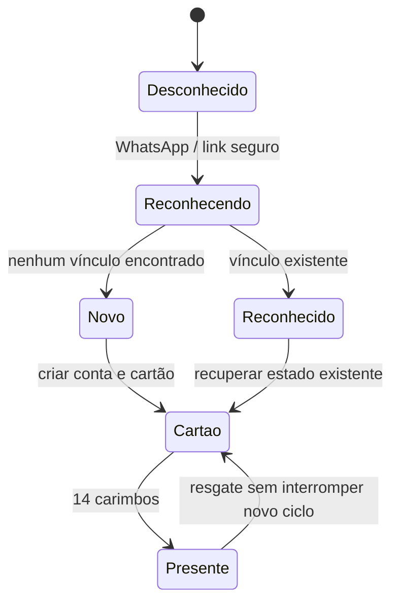
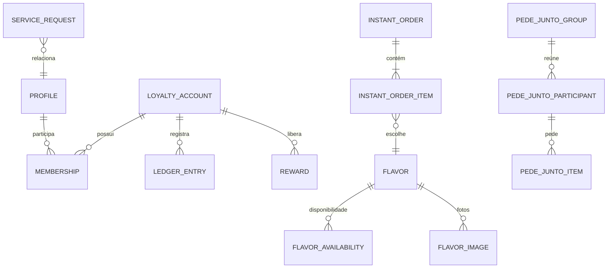
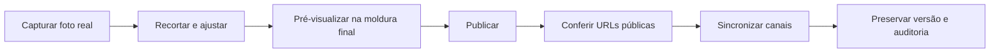

# Blueprint Mestre da Adoce

**Versão:** 1.0  
**Data-base:** 12/08/2026  
**Escopo:** negócio, marca, experiência do cliente, Clube Adoce, Adoce Hoje, Pede Junto, Adoce Operação, dados, segurança, integrações, SEO, publicação e evolução.  
**Documento complementar:** `01-brand-board-adoce.html`.

---

## 1. Decisão central

A Adoce não deve ser tratada como “um site com várias funções”. Ela é um sistema de venda e relacionamento composto por quatro superfícies claramente separadas:

1. **Site público:** desperta desejo, explica a oferta e conduz à compra.
2. **Adoce Hoje:** mostra o que existe agora e transforma disponibilidade em reserva.
3. **Clube Adoce:** reconhece pessoas, mostra progresso, entrega presentes e mantém relacionamento.
4. **Adoce Operação:** ajuda Beth e Rubens a cumprir as promessas feitas nas outras três superfícies.

O **Pede Junto** atravessa venda e operação, mas não vira uma quinta marca. Para o cliente, é uma forma de comprar em grupo; para a operação, é uma fila especializada de separação, pagamento e entrega.

> Regra de arquitetura: o cliente nunca vê o bastidor; o bastidor sempre enxerga a promessa feita ao cliente.

---

## 2. Resultado de negócio que organiza o sistema

### Horizonte imediato — 60 dias

- Aumentar de **28 para 35 tortas por semana**.
- Reduzir pedidos perdidos por falta de resposta, estoque incoerente ou fluxo confuso.
- Tornar a venda presencial, hoje estimada em cerca de **80%**, registrável em poucos toques.
- Fazer o site funcionar como vitrine e pré-venda, sem criar promessas que a Beth não consegue cumprir.

### Horizonte de relacionamento — 6 meses

- Aumentar retorno de clientes por meio do Clube, avisos de sabores e presentes conquistados.
- Tornar carteira, QR, histórico e identidade consistentes em qualquer aparelho.
- Identificar os segmentos com maior potencial: perto do presente, inativos, fãs de sabores e clientes recorrentes.

### Horizonte estrutural — 12 meses

- Operar um CRM leve e útil, não uma base de contatos parada.
- Consolidar site, WhatsApp, Instagram, catálogo Meta e operação sobre a mesma fonte de verdade.
- Evoluir Supabase Free para Pro dentro do limite definido de 6 a 12 meses, conforme carga e risco.

### Métricas norteadoras

| Dimensão | Indicador | Meta ou interpretação |
|---|---|---|
| Venda | Tortas por semana | 35 em até 60 dias |
| Conversão | Visita → início de pedido | Crescimento semanal, separado por canal |
| Cumprimento | Pedido sem resposta | Zero pedido invisível na fila |
| Estoque | Reserva sem baixa correta | Zero |
| Clube | Cliente reconhecido reenviado ao cadastro | Zero |
| Fidelidade | Ciclo completo → presente usado | Acompanhar sem pressionar resgate |
| Retenção | Segunda compra em 30 dias | Tendência crescente |
| Relacionamento | Aviso de sabor → compra | Medir por sabor e canal |
| Operação | Tempo para registrar venda presencial | Quatro toques no fluxo principal |
| Qualidade | Erros novos no console em fluxos críticos | Zero |

---

## 3. Princípios imutáveis

### Marca e interface

- Cor, fonte e medida nascem em `src/adoce-tokens.css`.
- As cinco cores literais do manual são rosa creme `#FBE3DD`, rosa cupcake `#E89A91`, chocolate `#3B1F12`, caramelo `#E8AD67` e branco quente `#FFF9F6`.
- **Chocolate age, rosa acolhe, caramelo aponta.**
- Playfair Display Bold é voz; Inter é leitura e operação.
- A logo fica sobre fundo liso, com respiro, sem deformação.
- Nenhum carrossel.
- Mobile primeiro; alvo de toque mínimo de 44 px; campos nunca abaixo de 16 px.
- A assinatura encerra toda página do cliente: *“Doce feito com afeto, para celebrar cada momento.”*

### Produto

- Não se vende o que não tem custo apurado.
- Não existe montador de torta enquanto custos e limites não forem confiáveis.
- Presente não é desconto e não altera o total da compra.
- Promoção não retira carimbo.
- Uma pessoa conhecida nunca é enviada novamente ao cadastro.
- Toda tela tem saída e próximo passo.
- Disponibilidade, preço, horário e dados estruturados só declaram o que é verdade.

### Operação e segurança

- Nenhum pagamento do Pede Junto é gerado antes de a operação confirmar a separação.
- Operações incorretas são revertidas com vínculo; nunca apagadas.
- RLS não é afrouxada e nenhuma permissão nova é concedida a `anon` ou `authenticated` sem desenho explícito.
- Chaves administrativas, dados pessoais e rotinas internas nunca chegam ao navegador público.
- `fin_*` é planejamento pessoal isolado; não se mistura com o caixa da Adoce.
- O gatilho `private.sincronizar_reserva_de_fatias()` e seus dois triggers são infraestrutura crítica de venda.

---

## 4. Mapa do ecossistema

### Fonte de verdade por assunto

| Assunto | Fonte de verdade | Superfícies consumidoras |
|---|---|---|
| Sabores e fotos | `flavors`, `flavor_images`, mídia comercial | Site, Adoce Hoje, Meta, Operação |
| Estoque por dia | `flavor_availability` e regras semanais | Adoce Hoje, venda manual, reservas |
| Pedido imediato | `instant_orders` e `instant_order_items` | Cliente, painel do dia, esteira, arquivo |
| Fidelidade | `ledger_entries`, contas e trilhas | Clube, balcão, perfil, relatórios |
| Pede Junto | `pede_junto_*` | Sala do grupo, pagamento, operação |
| Encomendas | `service_requests`, agenda e configurações | Catálogo, orçamento, produção |
| Horário | `business_hours` e exceções | Home, SEO, Ajustes |
| Conteúdo visual | ativos e versões | Site, catálogo, Central de Imagens |
| Auditoria | `audit_events` e históricos vinculados | Proprietário, segurança, aceite |

---

## 5. Pessoas, contexto e necessidades

| Pessoa | Contexto real | Precisa conseguir | O sistema não pode exigir |
|---|---|---|---|
| Cliente com fome agora | Celular, rua, conexão variável | Ver o que tem, reservar e falar no WhatsApp | Cadastro obrigatório para comprar |
| Cliente recorrente | Já tem carimbos | Ser reconhecido e ver o cartão imediatamente | Recomeçar cadastro ou perder histórico |
| Organizador do grupo | Amigos, trabalho ou condomínio | Juntar pedidos sem cobrar todo mundo | Assumir os pagamentos individuais |
| Beth | De pé, produzindo e atendendo | Ver urgências, buscar cliente e agir rápido | Navegar por telas densas ou lembrar estados |
| Rubens | Gestão, tecnologia e crescimento | Ver resultado, risco, integrações e pendências | Confundir caixa da Adoce com finanças pessoais |
| Atendente futuro | Treinamento curto | Executar venda, carimbo e retirada com segurança | Acesso a financeiro, estratégia ou dados excessivos |
| Produção futura | Tablet da bancada | Ler fila e quantidades de longe | Ver dados pessoais ou financeiros |

---

## 6. Arquitetura de experiência do cliente

### 6.1 Descoberta

**Critério:** em menos de um enquadramento do celular, a pessoa entende o que existe, se pode comprar agora e qual é a próxima ação.

### 6.2 Reserva de fatias

1. Escolher sabor e quantidade.
2. Escolher calda por fatia; “Sem calda” é opção válida.
3. Aplicar presente como linha separada, sem reduzir artificialmente o preço mostrado.
4. Ver total e a frase “Você paga na retirada. Nada é cobrado agora.”
5. Informar nome, WhatsApp e observação — sem cadastro e sem cartão.
6. Receber número legível, horário/local e botão principal “Falar com a Adoce”.
7. Acompanhar `aguardando confirmação → reservado → preparando → pronto → concluído`.

**Invariante:** criar pedido e baixar disponibilidade formam uma operação coerente. A validação real precisa provar que uma reserva reduz a fatia correta.

### 6.3 Encomendas e docinhos

- Tortas: tamanhos e preços fixos, fotos organizadas por tamanho, sem montador.
- Docinhos: mínimo 25, passo 25, composição de pacotes visível e limite de sabores explicado antes do envio.
- Eventos, Escola e Decoração: conteúdo empilhado, sem carrossel, com antecedência e capacidade claras.
- Encerramento: WhatsApp com resumo; “A Beth confirma o valor final com você.”

### 6.4 Identidade e Clube

- Uma porta de entrada, centrada em WhatsApp.
- “Primeira vez?” e “Já é de casa?” são resolvidos pela mesma decisão.
- O cartão usa grade de cinco colunas.
- O 14º marco libera um presente; o novo ciclo começa imediatamente.
- QR tem código curto legível para contingência.
- Compartilhamento de cartão usa link temporário e não expõe telefone.
- Indicação concede carimbo após primeira compra válida; não concede desconto.

### 6.5 Pede Junto

1. Organizador abre grupo e compartilha link.
2. Participantes escolhem suas fatias e podem deixar recado curto.
3. Grupo fecha ao atingir o mínimo operacional; cinco é mínimo, nunca teto.
4. Operação confere estoque e separa.
5. Somente após `fechado && separado` o sistema gera um link por participante.
6. Organizador vê apenas nome, fatias e “pagou”.
7. Entrega pode ser liberada com pagamento pendente por decisão da operação.

---

## 7. Arquitetura da Adoce Operação

### 7.1 Porta única: Painel do Dia

Ordem visual obrigatória:

1. Busca de cliente sempre visível no cabeçalho.
2. Pedidos esperando, com quantidade e hora do mais antigo.
3. Ações por pedido: confirmar, imprimir, chamar no WhatsApp.
4. Resultado do dia: fatias e valor recebido.
5. Gavetas com contagem: Estoque, Clientes, Encomendas, Pede Junto e Ajustes.
6. Ação isolada “Atender no balcão”.

### 7.2 Tarefas principais

| Área | Trabalho principal | Decisão de interface |
|---|---|---|
| Balcão | Identificar, carimbar e resgatar | Presente sobe ao topo; botões de 52 px; desfazer por 10 minutos |
| Venda manual | Registrar os 80% presenciais | Quatro toques: sabor, calda, pagamento, concluir |
| Esteira | Separar pedidos | Dois cartões por linha no tablet, quantidade antes do sabor, tela acordada |
| Ficha térmica | Conferir antes de imprimir | Prévia real de 32 colunas, acentos e quebra por palavra |
| Estoque | Controlar o que existe hoje | “Acabou hoje”, “Não foi feito hoje” e contador são estados diferentes |
| Encomendas | Proteger capacidade | Agenda por dia e barra 29/35; alerta antes de sobrecarga |
| Clientes | Recuperar vendas paradas | Perto do presente, sumiram e fãs do sabor |
| Espera | Traduzir desejo em produção | Agrupar “Me avisa” por sabor e cruzar com cardápio |
| Pede Junto | Separar e liberar cobrança | Divergência de estoque visível antes de gerar links |
| Financeiro | Informar decisão sem falsa precisão | Custos faltantes aparecem junto do resultado |
| Avisos | Mostrar falha de comunicação | Motivo em português e ação de reenviar |
| Arquivo | Recuperar exceções | Filtro “Não retirados” como prioridade |
| Feedback | Fechar ciclo com cliente | Crítica na frente, assunto agregado e resposta |
| Ajustes | Configurar operação | Horário, teste de aviso, impressora e lacunas de foto |

### 7.3 Papéis e permissões

| Capacidade | Atendente | Produção | Gerente | Proprietário |
|---|:---:|:---:|:---:|:---:|
| Venda e retirada | Sim | Leitura | Sim | Sim |
| Buscar cliente | Sim | Não | Sim | Sim |
| Carimbar e resgatar | Sim | Não | Sim | Sim |
| Ver esteira | Sim | Sim | Sim | Sim |
| Alterar estoque | Limitado | Sim | Sim | Sim |
| Ajustes e reversões | Não | Não | Sim | Sim |
| Financeiro | Não | Não | Conforme decisão | Sim |
| Equipe e permissões | Não | Não | Não | Sim |
| Auditoria e configuração global | Não | Não | Não | Sim |

Autenticação social nunca concede papel de equipe. O acesso depende de vínculo ativo em `staff_members`.

---

## 8. Inventário de telas e divergência de contagem

O índice de 11/08/2026 declara **64 telas**, sendo “Cliente (34)” e “Operação (24)”. Essa soma resulta em 58. Quando os itens compostos são expandidos — Festas/Escola/Decoração, três telas de Pede Junto e três páginas legais — a lista do cliente pode chegar a 44, levando o total a 68.

**Decisão deste blueprint:** preservar o rótulo histórico “64 telas”, mas controlar execução por **experiências verificáveis**, sem esconder a divergência. A contagem final deve ser normalizada quando os 64 desenhos originais forem reunidos em uma única fonte visual.

### 8.1 Experiências do cliente

| Núcleo | Telas ou estados |
|---|---|
| Entrada e resiliência | Abertura; Entrar; Código/validação; Já reconhecido; Link expirado; Sem internet; 404 |
| Home e descoberta | Home; Nossos sabores; Busca; Aviso de fatia; Promoções; Cardápio da semana |
| Compra imediata | Adoce Hoje; Carrinho; Finalizar reserva; Confirmação; Acompanhar pedido |
| Encomendas | Catálogo comercial; Tortas; Docinhos; Festas; Adoce na Escola; Decoração; Orçamento |
| Pede Junto | Grupo; participante; pagamento; minichat; acompanhamento |
| Clube | Landing; Cartão; Presente liberado; QR; Compartilhar cartão; Carteira; Movimentações; Indicação |
| Conta e suporte | Minha conta; Segurança; Instalar; Ajuda; Fale com a Adoce |
| Legais | Termos; Privacidade; Política de pedidos/cancelamento |

### 8.2 Experiências da operação

| Núcleo | Telas ou estados |
|---|---|
| Hoje | Painel do dia; Balcão; Ficha do cliente; Venda manual |
| Produção | Esteira; Ficha térmica; Estoque do dia; Agenda de produção |
| Vendas | Encomendas da semana; Pede Junto; Financeiro; Solicitações |
| Relacionamento | Clientes; Relacionamento; Quem está esperando; Feedback |
| Controle | Central de avisos; Arquivo; Ajustes; Equipe |
| Conteúdo | Cardápio da semana; Fotos; Caldas; Catálogo Meta |
| Conhecimento | Documentação |

---

## 9. Estado real observado em 12/08/2026

### 9.1 Dimensão técnica

- 68 arquivos TSX.
- 140 arquivos TypeScript.
- 86 folhas CSS.
- 94 arquivos de teste encontrados no código.
- 22 funções Netlify públicas, além de auxiliares internos.
- 160 arquivos locais de migração; dois são marcadores históricos que repetem versões já registradas remotamente.
- Produção atualizada até a migração `20260812043651_flavor_seo_slugs`.

### 9.2 Integrações encontradas pelo código

| Módulo | Evidência de integração | Estado prudente |
|---|---|---|
| `decidirPorta()` | Referenciado por `AccessApp` e `ClubExperience` | Integrado em parte; ainda exige prova autenticada de todos os caminhos |
| Pacotes de docinhos | Referenciado por `CommercialCatalog` | Integrado; mínimo e passo 25 observados |
| `ExperienciaAdoce` | Referenciado por `CommercialCatalog` | Integrado em Eventos/Escola/Decoração |
| Venda manual | `OperationInstantOrders` chama `OperationManualSale` | Integrado no código; precisa teste operacional autenticado |
| Esteira | `OperationInstantOrders` chama `PedidoNaEsteira` | Integrado no código; precisa teste no tablet |
| Ficha térmica | `OperationCommercialAdmin` chama `FichaTermica` | Integrada no código; impressão física não comprovada |
| `CompartilheDocura` | Arquivo existe, sem referência de tela encontrada | Órfão / não integrado |
| Impressora térmica | Biblioteca e teste existem, sem referência textual de tela encontrada | Não comprovadamente integrada |
| `PainelDoDia` | Componente existe, sem referência encontrada | Órfão ou ainda fora da porta principal |
| `BalcaoAtendimento` | Componente existe, sem referência encontrada | Órfão ou ainda fora da porta principal |
| `PedeJuntoPagamento` | Componente existe, sem referência encontrada | Órfão / não integrado |

### 9.3 Produção validada publicamente

- Home responde no domínio oficial.
- Rotas desconhecidas recebem o fallback do site.
- A página estática de sabor contém texto sem executar JavaScript.
- Sitemap contém 30 URLs, incluindo 26 sabores.
- `#sabores` apresenta 26 sabores, fotos, preço e ampliação.
- Docinhos expõem quantidade mínima 25 e passo 25.
- Eventos não apresentaram carrossel nem rolagem horizontal na verificação executada.
- As seis rotas antigas de demonstração não exibem mais as demonstrações; caem na home.

### 9.4 O que ainda não possui prova completa

- Reserva real baixando estoque em produção.
- Recebimento simultâneo no Telegram e no celular.
- Cliente com carimbos entrando sem qualquer oferta de cadastro.
- Fluxos autenticados da Central Adoce e da Operação.
- Impressão física na Knup KP-1025 via Galaxy Tab A7 Lite.
- Apple Wallet e Google Wallet reais.
- Pagamento individual do Pede Junto em produção.
- Sincronização Meta completa com credenciais definitivas.

---

## 10. Blueprint de dados e integridade

### 10.1 Domínios

### 10.2 Invariantes

- O livro de fidelidade é imutável; correção é nova movimentação reversora.
- Uma chave de operação impede processamento duplicado.
- O total reservado não pode superar a disponibilidade livre.
- Um presente consumido não reduz progresso do ciclo atual.
- Autoindicação e indicação dupla são proibidas.
- Cancelamento da primeira compra reverte ambos os bônus.
- Participante não vê pagamento alheio além do estado permitido.
- Estoque zero e estado “disponível” não podem coexistir na vitrine.
- “Não foi feito hoje” continua visível para desejo, mas não reservável.

### 10.3 Privacidade e LGPD

- Coletar apenas o necessário por fluxo.
- Consentimento de marketing separado de termos e serviço.
- Exportação, correção e anonimização com histórico de solicitação.
- Links compartilhados não expõem telefone.
- Logs não guardam segredo, token integral ou dado desnecessário.
- Retenção e tratamento contábil ainda dependem de decisão formal.

---

## 11. Integrações e dependências externas

| Integração | Valor | Estado desejado | Dependência explícita |
|---|---|---|---|
| WhatsApp | Canal principal de continuidade e entrada | Link, contato e API oficial onde aplicável | Número dedicado e aprovação Meta |
| Telegram | Aviso operacional redundante | Pedido e falha visíveis | Bot, chat e monitoramento |
| Web Push | Aviso no celular/tablet | Canal secundário da operação | Permissão do aparelho e assinatura |
| Meta Catalog | Produto onde o público já está | Sincronização diária e retirada imediata de esgotado | Business ID, catálogo, token permanente, número dedicado, webhook |
| Instagram | Descoberta e relacionamento | Comentários, stories e encaminhamento seguro | Conta profissional, app, tokens e política aprovada |
| Mercado Pago | Cobrança individual no Pede Junto | Preferência por participante após separação | Credencial de produção e webhook |
| Apple Wallet | Cartão disponível sem abrir site | Passe real e atualizável | Pass Type ID, certificado e senha segura |
| Google Wallet | Cartão Android | Passe real e atualizável | Issuer ID e conta de serviço |
| Google Search | Descoberta orgânica futura | Páginas estáticas, schema e sitemap | Tempo, consistência e conteúdo verdadeiro |
| Perfil da Empresa Google | Aquisição local de curto prazo | Fotos, horário, produtos e respostas atualizados | Trabalho manual do proprietário |

### Chaves previstas no projeto

O arquivo de exemplo já prevê variáveis para Supabase, Meta/Instagram/WhatsApp, Wallets, Netlify, armazenamento, Redis, e-mail e observabilidade. O blueprint não presume que estejam preenchidas em produção; cada integração só muda para “ativa” após teste real.

---

## 12. SEO e descoberta local

### Estrutura indexável

- Home.
- 26 páginas estáticas de sabores em `/sabores/{slug}`.
- Encomendas.
- Festas.
- Landing pública do Clube.
- Fora do sitemap: operação, carrinho, áreas autenticadas e documentação interna.

### Requisitos por sabor

- Slug persistido na tabela, independente de futuras alterações do nome.
- Nome, foto, resumo, preço e dia habitual presentes no HTML do build.
- Título e descrição próprios.
- `og:image` real para compartilhamento no WhatsApp.
- `schema.org/Product` apenas com disponibilidade real.

### Home

- `schema.org/Bakery` com endereço, telefone e horário provenientes das configurações reais.
- Nenhuma disponibilidade ou horário inventado.

### Expectativa honesta

SEO é investimento de três a seis meses. O Perfil da Empresa no Google tende a produzir efeito local mais rápido e deve ser tratado como frente operacional paralela, não como promessa do código.

---

## 13. Conteúdo e fotografia como operação

### Fluxo editorial

### Regras

- Até seis fotos por produto, uma principal.
- JPEG, PNG e WebP até 4 MB; saída otimizada em WebP até 1600 px.
- Editor começa em “Preencher”, mostra o corte e oferece “Foto inteira”.
- Imagem nunca usa `object-fit: fill`.
- Central de Imagens mostra todas as URLs em que o ativo aparece.
- Foto ilustrativa é identificada.
- Sete produtos sem foto devem aparecer como tarefa, não como erro técnico.

---

## 14. Analytics sem invadir a pessoa

### Funil público

1. `home_viewed`
2. `catalog_category_opened`
3. `flavor_viewed`
4. `availability_alert_requested`
5. `cart_started`
6. `reservation_submitted`
7. `reservation_confirmed`
8. `whatsapp_handoff_opened`

### Clube

1. `club_entry_started`
2. `club_identity_recognized`
3. `club_card_viewed`
4. `wallet_install_started`
5. `wallet_install_completed`
6. `referral_shared`
7. `reward_redeemed`

### Operação

1. `order_seen_by_staff`
2. `order_confirmed`
3. `stock_adjusted`
4. `manual_sale_completed`
5. `notification_failed`
6. `notification_retried`
7. `print_attempted`
8. `print_completed`

### Limites

- Não enviar nome, telefone, e-mail ou observações pessoais ao analytics.
- IDs devem ser opacos e usados somente quando necessários para diagnóstico.
- Métrica não substitui auditoria transacional.

---

## 15. Estados, erros e contingência

| Situação | Mensagem humana | Saída operacional |
|---|---|---|
| Sem fatia hoje | “As fatias de hoje já acabaram.” | Cardápio da semana e “Me avisa” |
| Estoque divergente | “Só há 2 na bancada para 3 pedidos.” | Ajustar antes de separar |
| Link expirado | “Nada do seu cartão se perdeu.” | Reenviar, voltar ou falar com a Adoce |
| Sem internet | “Não é o site que quebrou — é o sinal.” | Cartão salvo e WhatsApp |
| Aviso falhou | Motivo em português | Reenviar e registrar resultado |
| Impressora indisponível | Explicar suporte e aparelho | PDF/ficha visual como contingência |
| Pagamento pendente | Mostrar estado, não bloquear sem decisão | Operação pode liberar entrega |
| Custo faltante | “3 encomendas ainda estão sem custo.” | Não afirmar lucro como definitivo |

### Procedimento de incidente de pedido

1. Tornar pedido não visto uma pendência visível no Painel do Dia.
2. Registrar falha do canal de aviso.
3. Reenviar por canal alternativo.
4. Contactar cliente pelo WhatsApp.
5. Corrigir estoque por reversão ou ajuste auditado.
6. Registrar causa e prevenção.

---

## 16. Qualidade e critérios de aceite

### Matriz de dispositivos

| Superfície | Prioridade | Larguras mínimas |
|---|---|---|
| Site público | Celular | 320, 360, 375, 390, 412, 430, 768, 1024, 1280 |
| Clube | Celular | Mesma matriz, com atenção a QR, Wallet e teclado |
| Adoce Hoje | Celular | Mesma matriz, com carrinho e rodapé fixo |
| Operação | Tablet compacto | 390, 768, 800/820, 1024 e 1280 |
| Impressão | Knup KP-1025 | Prévia 32 colunas + teste físico |

### O que validar em toda tela alterada

- carregamento;
- texto e acentuação;
- fotos e enquadramento;
- botões e estados desabilitados;
- modais;
- rolagem e barras fixas;
- teclado móvel;
- vazio, erro e sucesso;
- console do navegador;
- persistência real;
- permissões e separação de superfície.

### Classificação obrigatória

- implementado, ainda não testado;
- validado automaticamente;
- validado visualmente;
- validado em produção;
- parcialmente implementado;
- bloqueado por configuração externa.

Compilação, HTTP 200 ou deploy “ready” são portões, não prova final de jornada.

---

## 17. Segurança, publicação e recuperação

### Ambientes

| Ambiente | Uso | Regra |
|---|---|---|
| Local | Desenvolvimento e diagnóstico | Preservar mudanças existentes e dados reais |
| Homologação | Inspeção e fluxo seguro | Nunca tratá-la como prova da produção |
| Produção | Cliente e operação reais | Exige autorização explícita, gate e pós-validação |

### Gate de release

1. Confirmar escopo e árvore correta.
2. Conferir migrações locais e remotas.
3. Executar simulação de `db push`.
4. Preservar migrações exclusivas e dados `fin_*`.
5. Validar função e triggers de reserva antes e depois.
6. Rodar `npm run release:check`.
7. Publicar no projeto Netlify exato.
8. Reconsultar o deploy ativo e o domínio oficial.
9. Executar smoke tests públicos e autenticados.
10. Registrar evidência, risco e rollback.

### Recuperação

- Backup só é considerado concluído quando o arquivo é restaurável e a listagem de objetos não está vazia.
- Rollback de frontend não substitui rollback de banco.
- Migração aplicada não deve ser “apagada”; correção segue adiante com novo carimbo, após análise.
- Operações materiais devem preservar trilha de auditoria.

---

## 18. Roadmap recomendado

### Bloco 0 — estabilização pós-release

**Objetivo:** saber exatamente o que está no ar e fechar provas críticas.

- Testar reserva real e baixa de estoque.
- Confirmar Telegram + Web Push.
- Testar Clube com cliente que já possui carimbos.
- Testar Operação com proprietário.
- Resolver a divergência dos dois marcadores históricos locais de migração.
- Registrar alertas de segurança do banco e decidir correções sem ampliar grants.

**Saída:** produção conhecida, fluxo de venda comprovado e lista objetiva de riscos.

### Bloco 1 — ligar o que ainda está órfão

- Integrar `CompartilheDocura` em `#indicar` e no cartão.
- Integrar o driver de impressão à ficha e ao fluxo operacional.
- Tornar Painel do Dia a entrada efetiva da Operação.
- Ligar Balcão como fluxo próprio.
- Ligar pagamento/minichat do Pede Junto quando o backend e as credenciais permitirem.

**Saída:** nenhum módulo essencial existe apenas como arquivo e teste.

### Bloco 2 — cliente e venda

- Consolidar todas as experiências públicas sob o Brand Board.
- Implementar busca frustrada que vira sugestão.
- Fechar estados do pedido e acompanhamento.
- Revisar legais com aprovação explícita do proprietário.
- Garantir que toda tela possua saída.

**Saída:** compra e Clube coerentes do primeiro toque ao WhatsApp.

### Bloco 3 — operação

- Painel do Dia, busca persistente e scroll no topo.
- Balcão de quatro ações.
- Estoque com estados separados.
- Encomendas por capacidade diária.
- Clientes como fila de oportunidade.
- Central de avisos e contingência.
- Financeiro com alerta de custo incompleto.

**Saída:** Beth consegue operar sem depender da paciência técnica do Rubens.

### Bloco 4 — credenciais e canais

- Meta Catalog.
- Instagram.
- Mercado Pago.
- Apple Wallet.
- Google Wallet.
- Impressão física e instalação nos aparelhos reais.

**Saída:** cada integração marcada como ativa somente após prova real.

### Bloco 5 — busca e crescimento duradouro

- Monitorar sitemap e indexação.
- Manter páginas de sabores.
- Trabalhar Perfil da Empresa no Google.
- Publicar conteúdo verdadeiro de produto e ocasião.
- Medir busca → pedido sem prometer resultado rápido.

---

## 19. Plano 30 / 60 / 90 dias

### 0–30 dias: parar perdas

- Provar reserva, estoque e avisos.
- Colocar Painel do Dia e Balcão no caminho principal.
- Resolver módulos órfãos prioritários.
- Atualizar Perfil da Empresa no Google semanalmente.
- Medir pedidos não vistos, tempo de resposta e origem da venda.

### 31–60 dias: crescer tortas

- Destacar três tamanhos e preços claros.
- Usar clientes perto do presente e inativos para contato individual.
- Cruzar “Me avisa” com cardápio e produção.
- Acompanhar meta de 35 tortas por semana.
- Publicar conteúdo de ocasiões reais: escola, festa, trabalho e condomínio.

### 61–90 dias: escalar sem perder controle

- Ativar integrações com credenciais prontas.
- Consolidar carteira e Pede Junto pago.
- Fechar indicadores de retenção e recorrência.
- Revisar capacidade, custos e gargalos antes de ampliar catálogo.

---

## 20. Responsabilidades

| Tema | Rubens | Beth | Sistema | Futuro time |
|---|---|---|---|---|
| Estratégia, acesso e credenciais | Decide/providencia | Consulta | Protege e registra | Executa conforme papel |
| Produto e capacidade | Acompanha números | Define realidade diária | Impede promessa incompatível | Produção atualiza |
| Fotos e cardápio | Apoia publicação | Valida produto real | Distribui para canais | Conteúdo opera |
| Venda presencial | Acompanha | Responsável principal | Simplifica e audita | Atendente executa |
| Clube | Governa regra | Aplica no atendimento | Calcula sem duplicidade | Atendente consulta |
| Financeiro Adoce | Governa | Confere | Mostra custo incompleto | Gerente conforme permissão |
| Finanças pessoais `fin_*` | Proprietários | Proprietários | Mantém isolado | Sem acesso |
| Privacidade e segurança | Aprova política | Cumpre coleta mínima | RLS, logs e trilhas | Segue papel mínimo |

---

## 21. Decisões ainda abertas

1. Responsável e ritual da contagem de estoque.
2. Limite de reserva e regra de extensão.
3. Política de substituição quando falta sabor.
4. Entrega própria, regiões, taxa e prazo.
5. Parcelamento e estorno do Mercado Pago.
6. Troco, descontos e contingência sem internet.
7. Número dedicado da Meta.
8. Teste físico, momento e rodapé da impressão térmica.
9. Percentual de sinal e validade da reserva de encomenda.
10. Pessoas por papel e procedimento de contingência.
11. Retenção de dados e tratamento contábil.
12. Aprovação das promessas públicas nas páginas legais.
13. Normalização oficial da contagem de 64/68 telas.

---

## 22. Critério de conclusão do programa

O redesenho não termina quando todas as telas “existirem”. Termina quando:

- o cliente encontra, compra, acompanha e retorna sem cair em um beco;
- quem já é do Clube é reconhecido em todos os caminhos;
- uma reserva reduz o estoque correto e ninguém vende o que acabou;
- Beth vê o que precisa fazer agora, no topo, sem procurar;
- cada ação sensível deixa histórico;
- integração sem credencial aparece como desligada, nunca como simulada;
- o site, a Wallet, o WhatsApp, a Meta e a Operação contam a mesma verdade;
- os testes automáticos, a validação visual e a validação real de produção concordam.

> A melhor versão da Adoce não parece um sistema. Parece que alguém cuidadoso pensou no que a pessoa precisaria antes que ela perguntasse.

